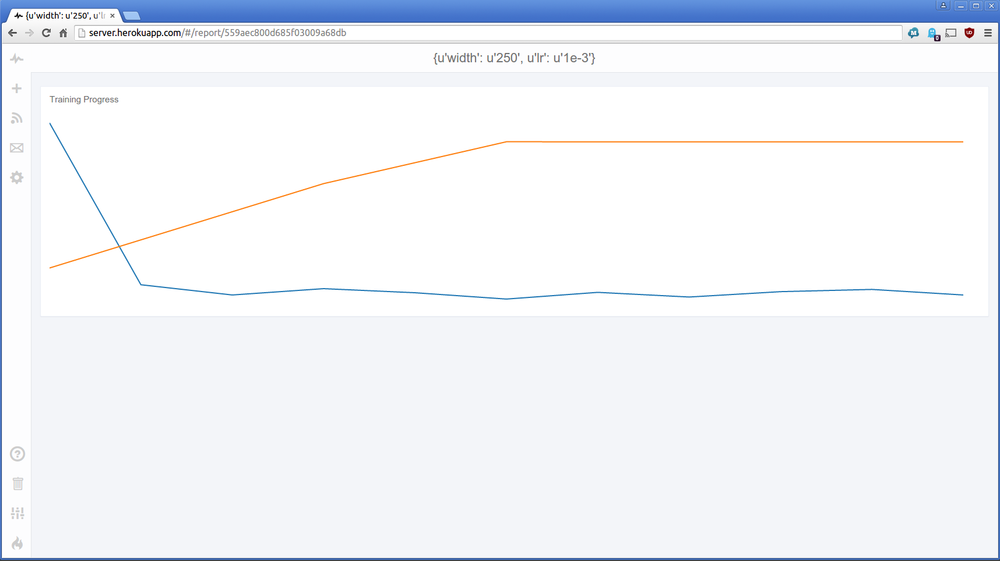

Mri-Server
=========

> Neural network monitoring

[](https://heroku.com/deploy)

This project is based on Reportr, the open source dashboard. For instructions specific to Reportr, please [see the project homepage](https://github.com/Reportr/dashboard).

Mri-server constitutes the web-based monitoring portion of Mri. When used together with the [Mri-client](https://github.com/Reportr), it allows you to watch the progress of your networks as they train from anywhere, as well as test multiple hyperparameters or architectures at once.

The project is entirely open source and you can host your own Mri-server instance on your own server or Heroku. 

[](./preview.png)

## Start your instance (only required if deploying by hand)

Mri-server is really easy to run locally or on heroku-compatible services. Note that if you used the *Deploy to Heroku* button above, you do not need to follow these steps unless you'd like to edit Mri-Server's codebase.

```
$ git clone https://github.com/Mri-monitoring/Mri-server.git 
$ npm install .
```

To run it locally, you should use [foreman](http://ddollar.github.io/foreman/) (configuration can be stored in a [.env file](https://devcenter.heroku.com/articles/config-vars#local-setup)):

```
$ foreman start
```

To deploy it on Heroku:

```
$ heroku config:set MONGODB_URL=mongodb://...
$ heroku config:set AUTH_USERNAME=...
$ heroku config:set AUTH_PASSWORD=...
$ git push heroku master
```

## Configuration

Reportr is configured using environment variables.

| Name | Description |
| ---- | ----------- |
| PORT | Port for running the application, default is 5000 |
| MONGODB_URL | Url for the mongoDB database |
| REDIS_URL | (Optional) Url for a redis database when using worker mode |
| AUTH_USERNAME | Username for authentication |
| AUTH_PASSWORD | Password for authentication |

## Running with Mri-Client
The Mri-Client already knows how to talk to the server, and will automatically create reports and visualizations as you train networks. Simply modify the Mri-Client configuration file to properly interface with the server as a dispatch. See the Reportr project page for full API specifications.

## Scale it

Reportr can easily be scaled on Heroku (and compatibles), use the `REDIS_URL` to enable a task queue between **workers** and **web** processes.
